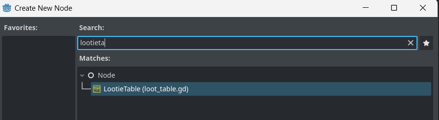
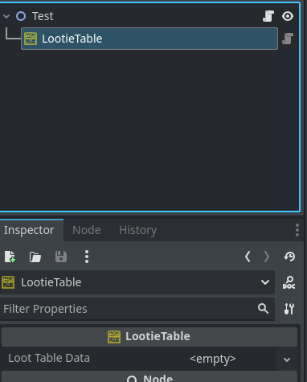
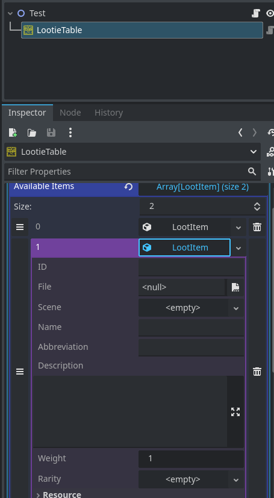

<div align="center">
	

<h3 align="center">Indie Blueprint RPG</h3>

  <p align="center">
 	 A set of components that can be used as basic building blocks for the construction of role playing games.
	<br />
	·
	<a href="https://github.com/ninetailsrabbit/indie-blueprint-rpg/issues/new?assignees=ninetailsrabbit&labels=%F0%9F%90%9B+bug&projects=&template=bug_report.md&title=">Report Bug</a>
	·
	<a href="https://github.com/ninetailsrabbit/indie-blueprint-rpg/issues/new?assignees=ninetailsrabbit&labels=%E2%AD%90+feature&projects=&template=feature_request.md&title=">Request Features</a>
  </p>
</div>

<br>
<br>

- [Installation 📦](#installation-)
- [Probability](#probability)
  - [Dice roller 🎲](#dice-roller-)
  - [Loot 💰](#loot-)
    - [Creating a new loot table.](#creating-a-new-loot-table)
      - [LootTableData](#loottabledata)
      - [LootItem](#lootitem)
      - [LootItemWeight](#lootitemweight)
      - [LootItemRarity](#lootitemrarity)
      - [LootItemChance](#lootitemchance)
    - [Adding items to a LootieTable](#adding-items-to-a-lootietable)
    - [Generating loot 🎲](#generating-loot-)
      - [Using Weight mode](#using-weight-mode)
      - [Using RollTier mode](#using-rolltier-mode)
      - [Using PercentageChance](#using-percentagechance)
      - [Using Combined](#using-combined)
- [Entities](#entities)
  - [Health 💚](#health-)
  - [Stats ⚔️](#stats-️)
    - [Character meta](#character-meta)
      - [Elemental resistances](#elemental-resistances)
      - [Negative status effects](#negative-status-effects)
- [Turns 🧠](#turns-)
  - [Available nodes](#available-nodes)
  - [Creating a new turn session](#creating-a-new-turn-session)
    - [Serial (classic turn mode)](#serial-classic-turn-mode)
  - [Handling turns](#handling-turns)
    - [Skip](#skip)
    - [Block](#block)
    - [Socket methods](#socket-methods)
  - [Turnity manager Signals](#turnity-manager-signals)
  - [Turnity socket Signals](#turnity-socket-signals)

# Installation 📦

1. [Download Latest Release](https://github.com/ninetailsrabbit/indie-blueprint-rpg/releases/latest)
2. Unpack the `addons/indie-blueprint-rpg` folder into your `/addons` folder within the Godot project
3. Enable this addon within the Godot settings: `Project > Project Settings > Plugins`

To better understand what branch to choose from for which Godot version, please refer to this table:
|Godot Version|indie-blueprint-rpg Branch|indie-blueprint-rpg Version|
|---|---|--|
|[](https://godotengine.org/)|`main`|`1.x`|

# Probability

## Dice roller 🎲

## Loot 💰

`Lootie` serves as a tool for game developers to define and manage the random generation of loot items within their games. It allows specifying a list of available items with their respective weights or rarity tiers, enabling the generation of loot with controlled probabilities.

The class offers various methods for adding, removing, and manipulating the loot items, along with three primary generation methods: `weight-based`, `roll-tier based` and `chance_based`

### Creating a new loot table.

To create a new table it's simple to add the node in the desired scene via editor:



---



#### LootTableData

This resource allows you to set the parameters for the `LootieTable` needs to generate the loot. As resource it can be reused so you can create it once and save it in your project.

```swift
class_name LootTableData extends Resource

enum ProbabilityMode {
	Weight, // The type of probability technique to apply on a loot, weight is the common case and generate random decimals while each time sum the weight of the next item.
	RollTier, //  The roll tier uses a max roll number and define a number range for each tier.
	PercentageProbability, // A standard chance based on percentages,
	WeightRollTierCombined, // The item needs to overcome a weight and roll tier to be looted
	WeightPercentageCombined, // The item needs to overcome a weight and percentage roll to be looted
	RollTierPercentageCombined, // The item needs to overcome a roll tier and percentage roll to be looted
	WeightPercentageRollTierCombined // The items needs to overcome all the probability modes to be looted
}

// The available items that will be used on a roll for this loot table
@export var available_items: Array[LootItem] = []

// The probability mode that set the rules to generate items from this table
@export var probability_mode: ProbabilityMode = ProbabilityMode.Weight

// The type of roll, when this is enabled the roll result will be executed per items instead of one per generation time
@export var roll_per_item: bool = false

// When this is enabled items can be repeated for multiple rolls on this generation
@export var allow_duplicates: bool = false

// Max items that this loot table can generate. Set to 0 to disable it and does not apply a limit in the loot generation
@export var items_limit_per_loot: int = 3

// When this is enabled, the "always drop items" count on the loot limit for this table.
@export var always_drop_items_count_on_limit: bool = false

// Each time a random number between min_roll_tier and max roll will be generated, based on this result if the number
// fits on one of the rarity roll ranges, items of this rarity will be picked randomly
@export var min_roll_tier: float = 0.0

// Each time a random number between min_roll_tier and max roll will be generated, based on this result if the number
// fits on one of the rarity roll ranges, items of this rarity will be picked randomly
@export var max_roll_tier: float = 100.0

// The max roll value will be clamped to the maximum that can be found in the items available for this loot table.
// So if you set this value to 100 and in the items the maximun found it's 80, this last will be used instead of 100
@export var limit_max_roll_tier_from_available_items: bool = false

// Set to zero to not use it. This has priority over seed_string. Define a seed for this loot table. Doing so will give you deterministic results across runs
@export var seed_value: int = 0

// Set it to empty to not use it. Define a seed string that will be hashed to use for deterministic results
@export var seed_string: String = ""

// You can set items when creating this resource via GDScript, it accept an array of Dictionaries that represent an item or the LootItem resource
// LootTableData.new([...])
func _init(items: Array[Variant] = []) -> void

```

#### LootItem

This is a resource that act as a wrapper for your original items in-game, provides a series of parameters that will be important for the `LootieTable` to perform the calculations and obtain this items.

The `LootieTable` returns this resource in all generations so extracting the item information depends on the logic of your game.

- When the `ProbabilityMode` is set to `Weight` the `LootItemWeight` resource needs to be set
- When the `ProbabilityMode` is set to `RollTier` the `LootItemRarity` resource needs to be set _(if you want that item to be obtainable by rarity)_
- When the `ProbabilityMode` is set to `PercentageProbability` the `LootItemChance` resource needs to be set
- When the `Probability` is any of `Combined` modes, the related resources needs to be set to make this item available in the loot.

This resources aditionally **can be created from a dictionary**, in this case, all values are optional and invalid keys will be ignored. The keys are converted to `snake_case` in the process so a key defined as `"iD"` will still be valid

```swift
LootItem.create_from({"id": "sword_1", "name": "Sword", "weight": LootItem.Weight.new(5.5) })
LootItem.create_from({"iD": "potion", "rarity": LootItemRarity.new(LootItemRarity.ItemRarity.Common, 0, 50) })
```

---

```swift
class_name LootItem extends Resource

// Unique identifier for this item
@export var id: String = ""

// An optional file path that represents this item
@export_file var file

// An optional scene that represents this item
@export var scene: PackedScene

// The name of the item
@export var name : String

// A shortcut to display the name in short form for limited ui in screen
@export var abbreviation : String

// A description more detailed about this item
@export_multiline var description : String

// Indicates whether this item should drop every time a loot is requested or not.
@export var should_drop_always: bool = false

// When enabled the item is eligible on loot generations
@export var is_enabled: bool = true

// The item is removed from the loot table when looted
@export var is_unique: bool = false

// The weight parameters for this item
@export var weight: LootItemWeight

// The grade of rarity for this item
@export var rarity: LootItemRarity

// The chance percentage for this item
@export var chance: LootItemChance

```

#### LootItemWeight

This is a simple resource that holds a value for the weight of this item. The higher the `weight` value, the more likely it is to come out. The `accum_weight` variable is used internally by the loot table for the related calculations, **It is recommended not to manipulate it**

```swift
class_name LootItemWeight extends Resource

// The weight value for this items to appear in a loot, the more the weight, more the chance to be looted
@export var value: float = 1.0

var accum_weight: float = 0.0
```

#### LootItemRarity

This is a simple resource to set the rules for the rarity of an item. The `min_roll` and `max_roll` is the range where this item can be obtained when the LootieTable makes a roll and generates a random value. This will be explained later but simply if it is between the `min_roll = 1` and `max_roll= 5`, a result of `3.5` would be valid to obtain this item and a `5.1` would not.

```swift
class_name LootItemRarity extends Resource

// Expand here as to adjust it to your game requirements
enum ItemRarity { COMMON, UNCOMMON, RARE, EPIC, LEGENDARY, MYTHIC, ETERNAL, ABYSSAL, COSMIC, DIVINE}

// The rarity definition
@export var rarity: ItemRarity = ItemRarity.COMMON

// The minimum value in range to be available on the roll pick
@export var min_roll: float

// The maximum value in range to be available on the roll pick
@export var max_roll: float
```

#### LootItemChance

This is a simple resource that holds a percentage value between `0` and `1.0` and a `deviation` that could increase or decrease the chance in a roll.

```swift
class_name LootItemChance extends Resource

// Set to zero to disable it. Chance in percentage to appear in a loot from 0 to 1.0, where 0.05 means 5% and 1.0 means 100%
@export_range(0.0, 1.0, 0.001) var value: float = 0.0

// A deviation to alter the results of this item by making it easier (-) or more difficult (+).
@export_range(-1.0, 1.0, 0.001) var deviation: float = 0.0

```

### Adding items to a LootieTable

This operation can be done **from the editor** or via script

**_From the editor:_**



---

**_From a script_**:

```swift
extends Node

@onready var lootie_table: LootieTable = $LootieTable

func _ready() -> void:
	// Multiple items at once
	lootie_table.add_items([LootItem.new(...), LootItem.new(...), LootItem.new(...)])

	// Individually
	lootie_table.add_item(LootItem.new(...))

	// The not recommended way to add new items
	lootie_table.loot_table_data.available_items.append(LootItem.new(...))
	lootie_table.loot_table_data.available_items.append_array([LootItem.new(...), LootItem.new(...), LootItem.new(...)])

	//Remove items by passing an Array of resources or ids
	lootie_table.remove_items([LootItem1, LootItem2])
	lootie_table.remove_items_by_id("sword_1", "basic_potion")

	//Remove item by passing the resource or the id
	lootie_table.remove_item(LootItem)
	lootie_table.remove_item_by_id("sword_1")
```

### Generating loot 🎲

The function `generate(times: int = 1)` it's the only thing you need, it accepts a number of `times` to roll.

The `LootieTable` uses the `LootTableData` that it uses as rules to generate loot based on the selected mode, **depending on your rules** it is possible for a roll **to return an empty array.** To avoid this you can set to true the variable `should_drop_always` in the items you want to always be looted.

```swift
var items_rolled: Array[LootItem] = lootie_table.generate() // Roll times set on default value
// Or
var items_rolled: Array[LootItem] = lootie_table.generate(10) // Roll 10 times so they are more chances to appear items in the loot

// You can change the probability type before rolling again
lootie_table.change_probability_type(LootTableData.ProbabilityMode.RollTier)

var items_rolled: Array[LootItem] = lootie_table.generate(3)

```

#### Using Weight mode

`weight` needs to be greater than zero on each `LootItem` to be valid for this roll

This method iterates through the available items, calculating their accumulative weights and randomly selecting items based on the accumulated weight values. It repeats this process for the specified `times` parameter, potentially returning up to `items_limit_per_loot` items while considering the `allow_duplicates` flag.

**The more the weight of the item, the more chances to appear in the loot**.

You can set the `extra_weight_bias` to increase the difficulty to generate the loot using `weight_mode`, this could be used to start with a high value and decrease it as the player progresses through the game e.g.

#### Using RollTier mode

**The items needs to have a `LootItemRarity` set to be valid for this roll**

This method generates random numbers within the specified `max_roll` range and compares them to the defined rarity tiers of the available items. Based on the roll results, it randomly selects items corresponding to the matching rarity tiers, repeating for the specified times parameter and potentially returning up to `items_limit_per_loot` while considering the `allow_duplicates` flag

As you notice in `LootItemRarity` there are two properties that works as a range:

- `min_roll`: The minimum roll value to be valid as posibly generated
- `max_roll`: The maximum roll value to be valid as posibly generated.

So if my item has a `min_roll` of 5 and `max_roll` of 20. Only values between 5 and 20 in each roll tier generation will be valid to return this item.

Higher roll ranges for an item in `roll_tier` generations means more probabilities to be returned.

Imagine I defined a `LootTable` with a `max_roll` of 100, so in each generation a random number between 0-100 will be randomly calculated. If the number is 7.55, items where this number falls within the valid range will be candidates for return.

#### Using PercentageChance

**The items needs to have a `LootItemChance` set to be valid for this roll**

This method uses `randf()` to generate a value between 0 and 1.0. If this value after applying the `deviation` is below the chance value for the item, it will go into the loot.

- Higher chance value for an item means more probabilities to be returned.
- A deviation to alter the results of this item by making it easier (-) or more difficult (+).

#### Using Combined

Any method with the `Combined` suffix will apply the same algorithms explained above but in this case the item must pass all the rolls in the combined methods.

So for example if `WeightRollTierCombined` is selected, the item must overcome a `weight` and a `roll tier` roll to appear in the loot.

**Note that items that are valid for these combined methods must have the related resources created in the `LootItem`**

# Entities

## Health 💚

Effortlessly simulate health and damage for entities within your video game.

This component handles all aspects related to taking damage and managing health on the parent node. While typically added to a `CharacterBody2D`, there are no limitations preventing its use with a `StaticRigidBody2D`, allowing you to imbue life into objects like trees or other in-game elements

**How to use**
Incorporate this component as a child node in the location where you intend to implement life and damage mechanics. Simply define the initial values you wish to assign to this component.

**Exported values:**

- `max_health`
- `health_overflow_percentage`
- `current_health`
- `health_regen_per_second`
- `is_invulnerable` _(The invulnerability flag, when is true no damage is received but can be healed)_
- `invulnerability_time`

The `max_health_overflow` is a calculated variable that represents the sum of the maximum health and the applied health overflow percentage.

**Example:** `max_health` of 120 and health overflow percentage of 15% = `138`

---

**Ready**

When this component becomes ready in the scene tree, a series of steps are carried out:

- Ensure that the current health does not exceed the maximum health.
- Establish the health regeneration timer.
- Set up the invulnerability timer.
- If the health regeneration per second exceeds zero, activate health regeneration.
- Establish a connection to its own health_changed signal. Whenever the health changes, this signal is triggered. If health regeneration is enabled, it is also triggered, and if the current health reaches zero, a died signal is emitted.
- Establish a connection to its own died signal. Once this signal is emitted, the built-in timers within the component are halted.
- ***

  **Taking damage**
  To subtract a specific amount of health, you can effortlessly invoke the `damage()` function within the component.

This triggers the emission of a `health_changed` signal each time damage is inflicted. Moreover, the component constantly monitors if the current health has plummeted to zero, subsequently triggering a died signal.

It's worth noting that the component is autonomously connected to its own died signal, concurrently ceasing the `health_regen_timer` and `invulnerability_timer`. If the is_invulnerable variable is set to true, any incoming damage, regardless of its magnitude, will be disregarded. Nevertheless, the standard signal broadcasting will persist as expected..

```swift
health_component.damage(10)
health_component.damage(99)

# Parameter is treated as absolute value
health_component.damage(-50) # translate to 50 inside the function
```

**Healing**

The functionality mirrors that of the damage function, but in this instance, health is added to the component. It's important to note that the healing process can never surpass the predetermined `max_health_overflow`. Following each execution of the health function, a health_changed signal is emitted.

```swift
health_component.health(25)

# Parameter is treated as absolute value
health_component.health(-50) # 50
```

**Health regeneration per second**

By default, health regeneration occurs every second. When the health component invokes the `damage()` function, regeneration is activated until the maximum health is reached, at which point it deactivates.

You have the flexibility to dynamically adjust the rate of regeneration per second using the `enable_health_regen` function. Alternatively, you can set it to zero to disable health regeneration altogether:

```swift
health_component.enable_health_regen(10)
# or disable it
health_component.enable_health_regen(0)
```

**Invulnerability**

You have the ability to toggle invulnerability on or off through the enable*invulnerability function. By providing the enable parameter *(a boolean)_, you can specify whether invulnerability is activated or not. Additionally, you can set a time duration _(in seconds)\_ during which the entity will be invulnerable. Once the specified time limit is reached, invulnerability will be deactivated:

```swift
health_component.enable_invulnerability(true, 2.5)

# You can deactivating it manually with
health_component.enable_invulnerability(false)
```

**When health reachs zero**

This component solely emits a "died" signal, offering you the flexibility to tailor the behavior to your game's needs. By establishing a connection to this signal, you can trigger animations, function calls, collect statistics, and perform other relevant actions to customize the experience according to your game's requirements..

**Death manual check**

Perform a manual check to ascertain if the entity has entered the death state. If you wish to manually determine this state, you can utilize the `check_is_death` function. This function emits the died signal if the current health reaches zero.

```swift
var is_dead: bool = health_component.check_is_death()
```

**Percentage of actual health**

If you intend to exhibit a health bar UI, you can access the health percentage format through the `get_health_percent()` function. This function returns a dictionary structured as follows:

```swift
# For instance, if 80% of the maximum health represents the current health:

{
   "current_health_percentage": 0.8,
   "overflow_health_percentage": 0.0,
   "overflow_health": 0
}

# Similarly, considering a maximum health of 100, a health overflow percentage of 20.0, and a current health of 120:

{ "current_health_percentage": 1.0,
   "overflow_health_percentage": 0.2,
   "overflow_health": 20
}
```

This information can aid in accurately representing the health status and overflow in a visual health bar.

**Signals:**

```swift
###
# You can access the action type in the health_changed signal
# to determine what kind of action was taken and act accordingly to the flow of your game.
###

enum TYPES {
	DAMAGE,
	HEALTH,
	REGEN
}

signal health_changed(amount: int, type: TYPES)
signal invulnerability_changed(active: bool)
signal died
```

## Stats ⚔️

This plugin provides a set of Resources to speed up the stats creation for your game entities. If you need more properties the way would be extending these resources and adding your properties

### Character meta

```swift
class_name RpgCharacterMetaStats extends Resource

enum ClassRange {
	C,
	B,
	A,
	S,
	S_Plus
}

enum ClassType {
	Fire,
	Water,
	Ice,
	Earth,
	Wind,
	Electric,
	Physical,
	Neutral,
	Machine,
	Shadow,
	Light
}

@export var level: int = 1
@export var class_range: ClassRange = ClassRange.C
@export var class_types: Array[ClassType] = [ClassType.Neutral]

@export var hp: int = 100:
	set(value):
		hp = clampi(value, 0, max_hp)
@export var max_hp: int = 100
@export var pm: int = 50:
	set(value):
		pm = clampi(value, 0, max_pm)
@export var max_pm: int = 50
@export var raw_physical_attack: int = 50
@export var raw_physical_defense: int = 50
@export var raw_magical_attack: int = 50
@export var raw_magical_defense: int = 50
@export var speed: float = 100.0
@export_category("Classic Stats")
@export var strength: int = 10
@export var constitution: int = 10
@export var dexterity: int = 10
@export var intelligence: int = 10
@export var wisdom: int = 10
@export var agility: int = 10
@export var evasion: int = 10
@export var accuracy: int = 10
@export var endurance: int = 10
@export var resistance: int = 10
@export var charisma: int = 10
@export var luck: int = 10
@export_category("Chances")
@export_range(0, 100.0, 0.01) var block_chance: float = 0.1
@export_range(0.0, 100.0, 0.01) var min_block_multiplier_reduction: float = 0.3
@export_range(0.0, 100.0, 0.01) var max_block_multiplier_reduction: float = 0.5
@export_range(0.0, 100.0, 0.01) var critical_chance: float = 0.1
@export_range(0.0, 100.0, 0.01) var min_critical_damage_multiplier: float = 1.5
@export_range(0.0, 100.0, 0.01) var max_critical_damage_multiplier: float = 2.0
@export var resistances: ElementalResistances
@export var negative_status_effects_resistances: NegativeStatusEffectsResistances


func is_c_range() -> bool:
	return class_range == ClassRange.C

func is_b_range() -> bool:
	return class_range == ClassRange.B

func is_a_range() -> bool:
	return class_range == ClassRange.A

func is_s_range() -> bool:
	return class_range == ClassRange.S

func is_s_plus_range() -> bool:
	return class_range == ClassRange.S_Plus


func is_fire() -> bool:
	return ClassType.Fire in class_types

func is_water() -> bool:
	return ClassType.Water in class_types

func is_ice() -> bool:
	return ClassType.Ice in class_types

func is_earth() -> bool:
	return ClassType.Earth in class_types

func is_wind() -> bool:
	return ClassType.Wind in class_types

func is_electric() -> bool:
	return ClassType.Electric in class_types

func is_physical() -> bool:
	return ClassType.Physical in class_types

func is_neutral() -> bool:
	return ClassType.Neutral in class_types

func is_machine() -> bool:
	return ClassType.Machine in class_types

func is_shadow() -> bool:
	return ClassType.Shadow in class_types

func is_light() -> bool:
	return ClassType.Light in class_types
```

#### Elemental resistances

```swift
class_name ElementalResistances extends Resource

@export_range(0.0, 100.0, 0.01) var fire_resistance: float = 0.1
@export_range(0.0, 100.0, 0.01) var water_resistance: float = 0.1
@export_range(0.0, 100.0, 0.01) var ice_resistance: float = 0.1
@export_range(0.0, 100.0, 0.01) var wind_resistance: float = 0.1
@export_range(0.0, 100.0, 0.01) var earth_resistance: float = 0.1
@export_range(0.0, 100.0, 0.01) var plant_resistance: float = 0.1
@export_range(0.0, 100.0, 0.01) var electric_resistance: float = 0.1
@export_range(0.0, 100.0, 0.01) var machine_resistance: float = 0.1
@export_range(0.0, 100.0, 0.01) var shadow_resistance: float = 0.1
@export_range(0.0, 100.0, 0.01) var light_resistance: float = 0.1
```

#### Negative status effects

```swift
class_name NegativeStatusEffectsResistances extends Resource

@export_range(0.0, 100.0, 0.01) var poison_resistance: float = 0.1
@export_range(0.0, 100.0, 0.01) var sleep_resistance: float = 0.1
@export_range(0.0, 100.0, 0.01) var silence_resistance: float = 0.1
@export_range(0.0, 100.0, 0.01) var blind_resistance: float = 0.1
@export_range(0.0, 100.0, 0.01) var confuse_resistance: float = 0.1
@export_range(0.0, 100.0, 0.01) var curse_resistance: float = 0.1
@export_range(0.0, 100.0, 0.01) var burn_resistance: float = 0.1
@export_range(0.0, 100.0, 0.01) var wet_resistance: float = 0.1
@export_range(0.0, 100.0, 0.01) var freeze_resistance: float = 0.1
@export_range(0.0, 100.0, 0.01) var disease_resistance: float = 0.1
@export_range(0.0, 100.0, 0.01) var petrify_resistance: float = 0.1
@export_range(0.0, 100.0, 0.01) var paralysis_resistance: float = 0.1

```

# Turns 🧠

This plugin allows you to configure a turn based system by adding `TurnitySocket` nodes.

When you attach this node in your scene and link an actor to it, i.e. the node it belongs to _(player, enemy, etc.)_ understands that it must be added to the turn queue when it's initialized.

## Available nodes

- 🧠 **IndieBlueprintTurnityManager:** This singleton create or end turn sessions as well connect to signals, access sockets and so on.
- 🔌 **IndieBlueprintTurnitySocket:** This socket can be linked to a node in the scene representing the actor which can be accessed when the turn _(the socket)_ becomes active.

## Creating a new turn session

This plugin calls `session` at the start of a turn system. When this happens it starts the mechanism whereby sockets are activated or deactivated depending on how they are configured.

### Serial (classic turn mode)

This is the definition of the function that start sessions. When this function it's called the first socket in the list its `start()` method will be called automatically.

```swift
func start_new_serial_turn_session(ordered_sockets: Array[TurnitySocket], turn_duration: float = 0, max_turns: int = 0) -> Error:
```

```swift
var ordered_sockets: Array[TurnitySocket] = [turnity_socket, turnity_socket2, turnity_socket3, turnity_socket4]

IndieBlueprintTurnityManager.start_new_serial_turn_session(ordered_sockets)

// Setting each turn duration and maximum number of turns
// Here we can start a session with 15 seconds per turn and 10 maximum turns
IndieBlueprintTurnityManager.start_new_serial_turn_session(ordered_sockets, 15, 10)
```

## Handling turns

To manually control the flow of the turn session you can access to the current socket via the `IndieBlueprintTurnityManager`

**A turn session needs to be active to have access to the current socket**

```swift
// Access the current socket
var current_socket: IndieBlueprintTurnitySocket = IndieBlueprintTurnityManager.current_turnity_socket
```

**_When you start a turn session with a time limit per turn, this flow is done automatically. You can still skip or block sockets in this mode._**

### Skip

Suddenly ends the turn and sends signals to know if the turn is over and skipped.

### Block

The socket is blocked the amount defined in the `block(turns_amount: int)` function, when the socket is blocked, in its turn it will be automatically skipped and the signals related to the blockage will be emitted.

You can unlock it manually with `unblock()`

### Socket methods

Once you got the socket, you have available the methods that allow you to start, end, skipe and other actions per turn

```swift
func start() -> void

func end() -> void

func skip() -> void

func block(turns_amount: int) -> void

func unblock() -> void:

func change_turn_duration(new_duration: float) -> IndieBlueprintTurnitySocket

func reset_turn_timer()

func stop_turn_timer()
```

## Turnity manager Signals

```swift
created_sequencial_turn_session(ordered_sockets: Array[IndieBlueprintTurnitySocket])
started_turn_session

ended_turn_session(total_turns: Array[IndieBlueprintTurnitySocket])

maximum_turns_reached(total_turns: Array[IndieBlueprintTurnitySocket])

started_turn(socket: IndieBlueprintTurnitySocket)

ended_turn(socket: IndieBlueprintTurnitySocket)

blocked_turn(socket: IndieBlueprintTurnitySocket, turns_blocked: int)

skipped_turn(socket: IndieBlueprintTurnitySocket)

changed_turn(from: IndieBlueprintTurnitySocket, to: IndieBlueprintTurnitySocket)

second_passed(socket: IndieBlueprintTurnitySocket, remaining_seconds: int)
```

## Turnity socket Signals

```swift
started_turn

ended_turn

skipped

blocked(turns_blocked: int)

unblocked

second_passed(remaining_seconds: int)
```
